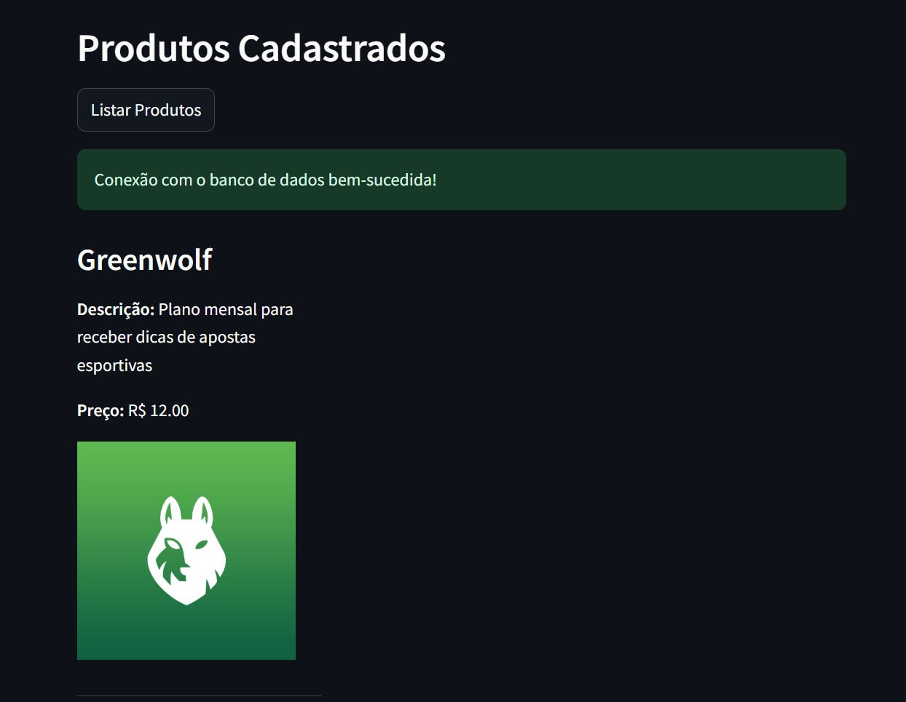
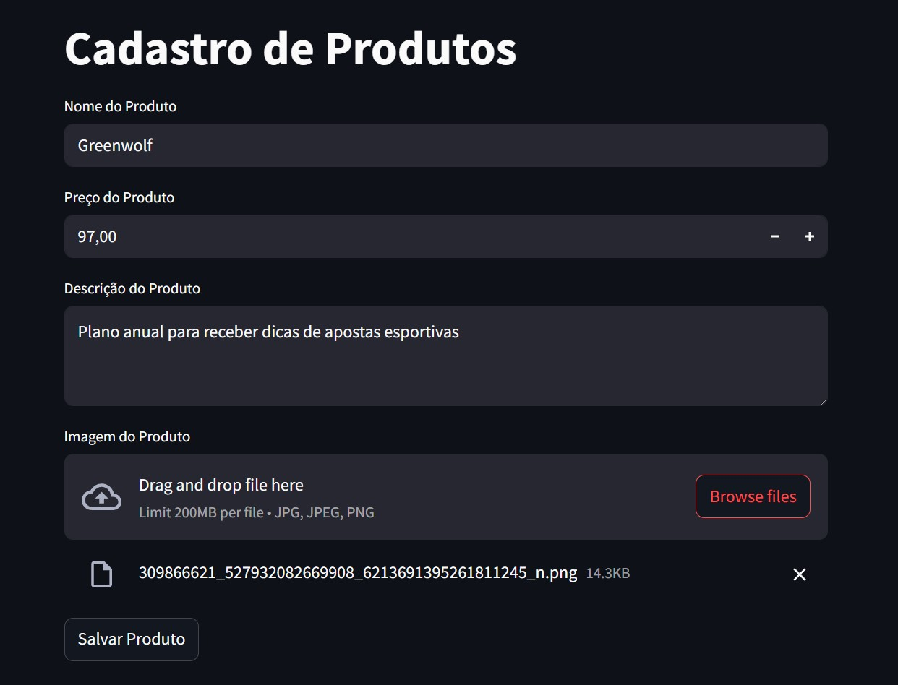
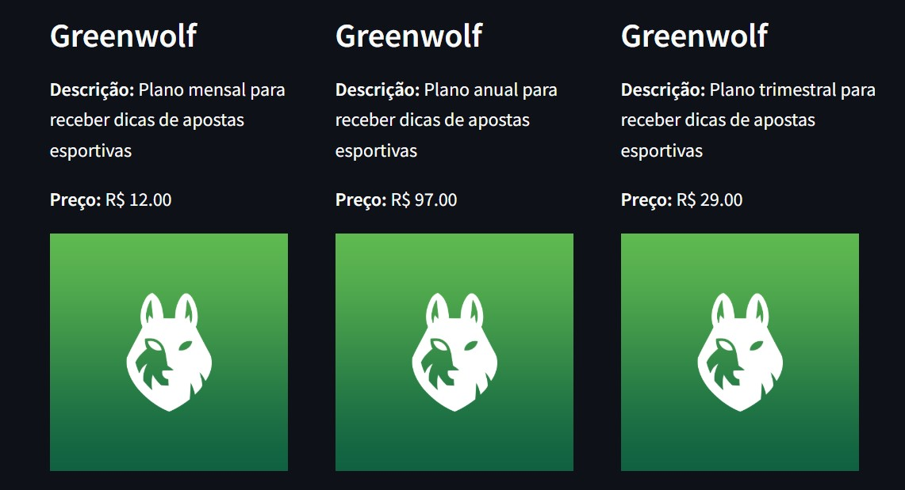

# dio-azure-cloud-native-desafio01
 Armazenando dados de um E-Commerce na Cloud

# Pré-requisitos
- Tenha uma conta no Portal do Microsoft Azure Cloud
- Crie uma Storage com acesso público a blob, e um container chamado fotos
- Crie um banco de dados SQL do Azure do tipo Serverless
- Crie a tabela de produtos com o script sql em infos.txt
- Preencha as informações que estão faltando em .env.example criando o seu .env
- ```pip install -r requirements.txt```
- ```streamlit run main.py```

 # SQL do Azure Serverless
Por ser um recurso serverless, optei por criar uma requisição de conexão com o banco quando abre a página, assim enquanto o usuário preenche a primeira vez os campos do formulário o sistema já aquece o banco, para ficar pronto para receber os dados.

Serve também para carregar os dados de produtos previamente cadastrados logo em seguida.



# Formulário via streamlit
Após preencher as informações do formulário gerado pela bilioteca streamlit e clicar em salvar, teremos a listagem atualizada com 3 produtos por linha.





